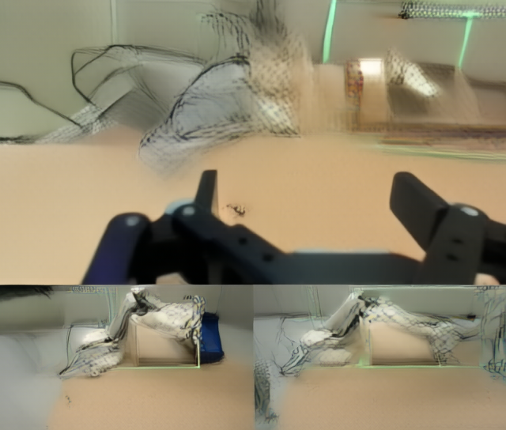
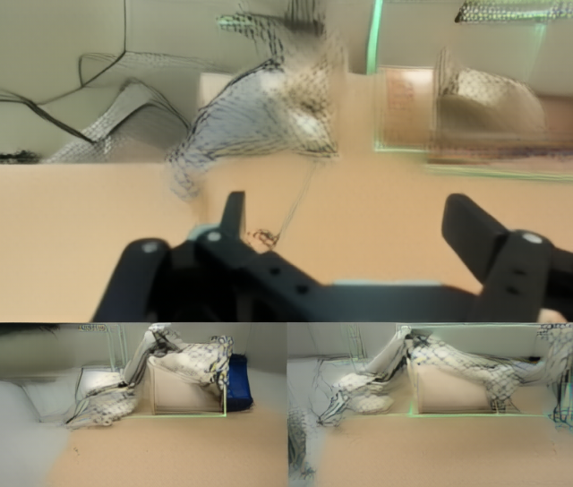

# FLUX 3 Action Model Card

<!-- meta: description: Model card for Black Forest Labs' FLUX 3 Action world action model on AWS Trainium2
with the vLLM Omni Neuron plugin. Covers the DROID policy, the recommended TP4 x CFG-parallel 2 (eight cores) configuration,
accuracy against an upstream CPU reference, performance, and known limitations. -->
<!-- meta: keywords: FLUX 3 Action, Black Forest Labs, model card, robot policy, world action model, DROID,
SO-101, action chunk, diffusion, flow matching, Cosmos UniPC, vLLM, vLLM Omni, Neuron, Trainium2, trn2,
NeuronCore-v3, BF16, tensor parallelism, Qwen3-VL, video VAE, neighborhood attention -->
<!-- meta: content_type: model-card -->
<!-- meta: date_updated: 2026-10-06 -->

## Introduction

[FLUX 3 Action](https://bfl.ai/models/flux-3-action) is Black Forest Labs' open-weights 7B world action
model. It takes camera frames, the robot's state and a text instruction, and denoises the next chunk of
actions jointly with the next video frames. It has:

- a **DiT trunk** (3072 hidden, 24 heads, 5 content-mode blocks per stream + 28 joint single-stream blocks)
  that attends over the concatenation `[text | video | video_cond | action | action_cond]`;
- a frozen **Qwen3-VL-4B** text encoder (8 stacked hidden layers -> a 20480-dim context);
- a frozen **ViTNorm video VAE** (Swin3D with neighborhood attention).

The released policies finetune this trunk with an embodiment-specific action head: **DROID** (7 joint
targets + gripper, 8 action dims, 32-action chunk) and **SO-101**. The shared video VAE and text encoder
live in the [base repository](https://huggingface.co/black-forest-labs/flux-3-action-base).

This port serves the DROID policy for inference with
[vLLM Omni](https://docs.vllm.ai/projects/vllm-omni/en/latest/) on AWS Trainium2 (`trn2`, NeuronCore-v3)
through the Neuron SDK. The DiT, the Cosmos UniPC solver's model calls and the frozen video VAE encoder run
on the NeuronCore.

**License:** [FLUX Kommunity License v.1.0](https://huggingface.co/black-forest-labs/flux-3-action-base)
(Black Forest Labs).

## Features

| Category | Feature | Status |
|---|---|---|
| **Generation** | DROID policy: three cameras + 8-dim state + instruction -> 32-step action chunk | ✅ |
| | Predicted video frames (decoded on the host) | Limited: slow host decode, see Known limitations |
| | SO-101 policy (history profile) | - |
| **Quantization** | BF16 | ✅ |
| | FP8r packages (`variants/*fp8r`) | - |
| **Parallelism** | Tensor Parallelism (TP) | ✅ (TP1, TP4, TP8) |
| | Context Parallelism (CP) | - (3.2k tokens per pass; see Known limitations) |
| | CFG Parallelism | ✅ (TP4 x CFG2 recommended) |
| | VAE Patch Parallelism | - (one fixed-shape frame per request; the encoder runs on rank 0) |
| **Compilation** | torch.compile | ✅ |

**Status legend:**

- ✅ Supported: integrated and tested for FLUX 3 Action.
- Limited: accepted, with the caveat noted.
- `-`: not supported.

### Recommended configuration

| Item | Value |
|---|---|
| Model | `black-forest-labs/flux-3-action-droid` (BF16 root package) |
| Hardware | eight NeuronCores on an adjacent Trn2 chip pair: two TP4 groups, one per CFG branch (3.5 GB of DiT weights per core) |
| Stage config | `examples/flux3_action/flux3_action_stage_tp4_cfg2.yaml` (`Flux3ActionPipeline`, TP4 x CFG2); alternatives `flux3_action_stage_tp4.yaml` (one chip), `flux3_action_stage_tp8.yaml`, `flux3_action_stage.yaml` (TP1) |
| Inference | the package's DROID settings: Cosmos UniPC order 2, 4 steps, shift 5, guidance 4.0 (video) / 1.0 (action) |
| Output | `(1, 32, 8)` absolute joint commands: seven joint targets in radians and the gripper closed fraction |

The DiT, the Cosmos UniPC solver's model calls, the action/video heads and the video VAE encoder run on the
NeuronCore (with several ranks the encoder runs on world rank 0 and the latent is broadcast). Under CFG
parallelism each TP4 group runs one guidance branch per step, the two outputs are exchanged and every rank
applies the same combine, so the result equals sequential CFG bit for bit. The exchange is a host all-gather
that returns the branches in CFG group-rank order (`host_all_gather`), so it stays correct on Trn2
physical-mesh layouts whose CFG groups are not in ascending rank order. The Qwen3-VL text encoder's 32
decoder layers also run on the NeuronCore, head-sharded over each TP4 group (each CFG group encodes for
itself), once per caption and cached; tokenisation, embeddings, mask and rotary tables stay on the host.
`model_config.vae_device: host` / `text_encoder_device: host` (or `FLUX3_ACTION_VAE_DEVICE=host` /
`FLUX3_ACTION_TEXT_DEVICE=host`) move either encoder back to the host.

## Accuracy Evaluation

Compared against the upstream `black-forest-labs/flux-action` reference run on CPU, on a fixed observation
and seed. Per the Neuron porting rule, the device error is judged against the CPU **bf16** error of the same
pipeline (not an absolute number), with an fp32 CPU run as the oracle.

| Path | Action rel-L2 vs fp32 oracle |
|---|---|
| CPU bf16 (upstream): the floor | 1.42% |
| **Device bf16, served, TP4 x CFG2, default placement (recommended)** | **2.16%** |
| Device bf16, served, TP4, default placement | 2.16% |
| Device bf16, served, TP8, default placement | 1.11% |
| Device bf16, served, TP1, default placement | 2.03% |
| Device bf16, served, TP4 x CFG2, caption encoder on the host | 1.16% |
| Device bf16, served, TP4, caption encoder on the host | 1.16% |
| Device bf16, served, TP8, caption encoder on the host | 2.47% |
| Device bf16, served, TP1, device VAE encoder, caption encoder on the host | 1.51% |
| Device bf16, served, TP1, host VAE and caption encoders | 2.26% |

Gate: device-vs-fp32 action rel-L2 <= 2 x (CPU-bf16-vs-fp32) + 0.5% = 3.34%. All device paths pass. The
headline row is the recommended configuration as shipped (DiT, VAE encoder and caption encoder all on the
NeuronCore), served through `omni.generate` with the real Qwen3-VL tokenizer: 2.16% is 1.5 x the CPU bf16
error and 2.32% from the CPU bf16 run itself (job `1006-134102-A8-T2-regate-a737586-quiet-time`, actions
bit-identical to the earlier `1005-144041-A8-T-tp4cfg2-devte-ranks`). **All eight ranks agree**: with
`FLUX3_ACTION_RANK_CHECK=1` (`serve_policy.py --rank-check`) every rank's action chunk and a digest of its
predicted video latents are gathered on every request; on all 10 requests of that job (warm, new-caption and
1-step) the eight ranks returned identical actions and latents. The TP4, TP8 and TP1 default-placement rows
use the shipped stage configs (jobs `1006-134102-A8-T2-regate-a737586-quiet-time` and
`1006-134937-A8-T2b-quiet-time-tp4-tp1`); TP4 and TP8 were re-run with `--rank-check` over the same 10
requests (job `1006-143955-A8-T3-ranks-tp4-tp8`): all 4 and all 8 ranks returned identical actions and
latents on every request, with the same accuracy (1-step: TP4 0.66%, TP8 0.52%). The caption-encoder-on-host rows are earlier runs: the two bf16
caption encoders round differently (each ~1% from fp32, see below), which moves the 4-step actions by about
1% either way, and how that combines with each layout's DiT rounding has no trend (TP8 is the largest error
with the host encoder and the smallest with the device one). TP4 against TP1 actions (both with the device
VAE encoder, caption encoder on the host): 1.2% rel-L2, max 0.048 rad. TP4 x CFG2 returns exactly TP4's
actions (CFG parallelism changes where the branches run, not the arithmetic).

Single-step check (tier 2: one Cosmos UniPC step, action rel-L2 vs the 1-step CPU fp32 reference; CPU bf16
floor 0.42%, gate 2 x 0.42% + 0.5% = 1.34%): TP4 x CFG2 default placement 0.66%; with the caption encoder on
the host TP4 0.59%, TP4 x CFG2 0.59%, TP8 0.58%.

Text encoder on the NeuronCore, stacked hidden states (8 x 2560) against a CPU fp32 encode, three captions:

| Caption | CPU bf16 vs fp32 (floor) | Device bf16 vs fp32 | Gate (2 x floor + 0.5%) |
|---|---|---|---|
| task caption | 0.89% | 0.53% | 2.27% |
| empty (CFG negative) | 0.94% | 0.61% | 2.37% |
| long instruction | 0.96% | 1.06% | 2.42% |

Served TP4 x CFG2 with the device caption encoder (the default) is the headline row above: 2.16%, 1-step
0.66%.

The VAE encoder on its own, posterior latent of the same observation against a CPU fp32 encode:

| Encoder path | Latent rel-L2 vs fp32 | Cosine |
|---|---|---|
| CPU bf16 (host encoder): the floor | 1.14% | 0.99994 |
| Device bf16 (NeuronCore) | 1.21% | 0.99993 |

Same gate form: 2 x 1.14% + 0.5% = 2.77%; the device encoder passes at 1.21%.


**Reproduce:**

```bash
# fixed DROID-shaped observation from the demo clip shipped with the policy
python examples/flux3_action/make_observation.py --policy <flux-3-action-droid> --output obs.npz
# upstream reference on CPU, bf16 and fp32 (needs a black-forest-labs/flux-action checkout)
export FLUX_ACTION_SRC=<flux-action checkout>/src
python -m test.unit.test_flux3_action_utils.reference --policy <flux-3-action-droid> \
    --base <flux-3-action-base> --obs obs.npz --out ref_bf16.pt
python -m test.unit.test_flux3_action_utils.reference --policy <flux-3-action-droid> \
    --base <flux-3-action-base> --obs obs.npz --out ref_fp32.pt --dtype float32
# this port on one NeuronCore, compared against the bf16 reference
python examples/flux3_action/run_policy.py --policy <flux-3-action-droid> --base <flux-3-action-base> \
    --obs obs.npz --out-dir out/ --reference ref_bf16.pt
```

The test suite mirrors the three accuracy tiers on a random-weight structure model with the released
layout: tier 1 components (`test/unit/test_flux3_action_components.py`,
`test/neuron/test_flux3_action_dit_device.py`, `test/neuron/test_flux3_action_vae_device.py`), tier 2 one denoising step
(`test/unit/test_flux3_action_single_step.py`) and tier 3 end to end (`test/unit/test_flux3_action_e2e.py`,
`test/neuron/test_flux3_action_policy_device.py`).

## Performance

Warm served latency on Trn2, DROID default (4 Cosmos UniPC steps, 2 CFG branches), same observation, timed by
the client around `omni.generate`. Every column is the shipped stage config (default placement: DiT, VAE
encoder and caption encoder on the NeuronCore), measured on a quiet host: after the first request and one
uncounted warm-up, the median of three warm requests, with the host's 1-minute load average read before each
request and required to be below 20 (it was 13.3-19.5 for every request; no request had to wait). Jobs
`1006-134102-A8-T2-regate-a737586-quiet-time` (TP4 x CFG2, TP8) and `1006-134937-A8-T2b-quiet-time-tp4-tp1`
(TP4, TP1). Per-stage numbers come from the pipeline's `stage_timing` (device work is synchronous in these
stages: each returns host tensors).

| Stage | TP1 | TP4 | **TP4 x CFG2** | TP8 |
|---|---|---|---|---|
| Cores | 1 | 4 (one chip) | 8 (chip pair) | 8 (chip pair) |
| VAE encode (device, rank 0 only) | 0.25 s | 0.25 s | 0.25 s | 0.25 s |
| DiT denoise, 4 steps x 2 CFG branches | 3.89 s | 1.36 s | **0.73 s** (incl. 0.02 s branch exchange) | 0.86 s |
| Request transport, parse, host glue | 0.03 s | 0.03 s | 0.03 s | 0.03 s |
| **Warm end to end** (3 warm requests) | 4.17 s (4.17-4.17) | 1.65 s (1.64-1.65) | **1.01 s** (1.005-1.006) | 1.14 s (1.14-1.15) |
| First request (compiled graphs cached) | 4.20 s | 1.70 s | 1.06 s | 1.20 s |
| Request with a new caption (median of 3) | - | - | 1.05 s | - |
| Server start + shutdown, NEFF cache warm (run wall minus requests) | ~94 s | ~97 s | ~90 s | ~93 s |
| DiT weights per core | 13.8 GB | 3.5 GB | 3.5 GB | 1.75 GB |
| Actions vs fp32 (4 steps; gate 3.34%) | 2.03% | 2.16% | 2.16% | 1.11% |
| 1-step check vs fp32 (gate 1.34%) | - | 0.66% | 0.66% | 0.52% |
| All ranks identical (`--rank-check`, 10 requests) | 1 rank | 4/4 | 8/8 | 8/8 |

**Recommended: TP4 x CFG2**: 1.01 s warm, against 1.65 s for TP4 on the same cores per branch. TP8 on the
same eight cores is 1.14 s: splitting the DiT 8 ways halves only part of each block (3 heads and a 1152-wide
FFN slice per rank, plus one all-reduce per block), while running the two branches at once halves the whole
denoise. The weights-per-core figures are the DiT shards; HBM was not sampled per core. The all-rank check
(`--rank-check`) adds about 0.1 s per request (job `1005-144844-A8-T-tp4cfg2-timing-ab`: 1.22 s against 1.12 s
on a busy host) and is off by default. The same configuration measured on a busy host (three other device
jobs, CPU references running) was 1.12 s warm and 1.48 s for the first request (`1005-144844`); server start
then varied from 168 s to 454 s.

Optimization passes, warm end to end:

| Change | TP1 | TP4 |
|---|---|---|
| Baseline (host VAE encode at the worker's default thread count) | 35.4 s | - |
| Host VAE encode with an explicit thread count (`FLUX3_ACTION_VAE_THREADS`, default 32) | 9.2-10.3 s | 14.3-15.1 s |
| VAE encoder on the device | 6.8 s | 4.4 s |
| Cameras sent as raw bytes instead of nested lists | - | 1.64 s (2.7x) |
| CFG-parallel (TP4 x CFG2, 8 cores) | - | **1.02 s** |

With the encoder on the host, the encode took 2.6-3.3 s at TP1 and 8.0 s on rank 0 at TP4, where the three
other worker processes compete for the host CPU. On the device it takes 0.25 s at every layout.

Caption encoder (served TP4 x CFG2, job `1004-102925-A8-text-enc-device`): a request with a caption the
worker has not seen took 2.77 s with the encoder on the host (text encode 1.27 s per rank, all eight ranks
encoding at once on the shared host CPU), against 1.03 s on the NeuronCore (text encode 0.02 s). The first
request after start-up (task + empty caption) dropped from 4.78 s to 1.05 s. Repeated captions hit the cache
either way (warm 1.015 s host, 1.007 s device). Device weights: 6.5 GB bf16 for 32 layers, 1.6 GB per core at
TP4; the host keeps only the embedding and layer 0's module.

The request fix: with the three 360x640 cameras sent as nested Python lists (~2.1 M ints), a warm TP4
request took 4.86 s, of which only 1.73 s ran in the pipeline. Timed end to end (client send time carried in
the request): building the lists 0.11 s, **client to worker 3.02 s** (serializing and copying the lists
through the engine's process hops), parsing them back 0.11 s, VAE encode 0.25 s, denoise 1.37 s, return
0.006 s. As raw bytes (`{"data", "shape", "dtype"}` per camera, `observation.encode_camera`) the same
request is 1.64 s: build 0.02 s, client to worker 0.004 s, parse 0.001 s. Nested lists are still accepted.

The encoder compiles as one graph per distinct piece (patch embedding, one transformer block per grid,
the patch and temporal merges, the output projection), and each repeated block replays its piece's graph
with its own weights: 10 graphs for 30 pieces. The neighborhood attention uses the plugin's shared halo-tiled
op (`vllm_omni_neuron.diffusion.attention.neighborhood_attention`) with 17x23 query tiles at every stage
(`FLUX3_ACTION_NA_TILE=pf24`, no padded tiles); the bias and window-selection inputs are built on the host
once per grid. A cold compile of the encoder takes about 5 minutes, most of it the 136x184 first-stage block.

## Known limitations

### Context parallelism is not offered

CP splits the sequence across ranks; a DiT pass here is only 3173 tokens (80 text + 2720 predicted video + 340
observation + 32 action + 1 state), i.e. ~1587 tokens per rank at CP2 and ~794 at CP4. Each block is already
small at this length (the 33 blocks x 8 calls take 1.36 s at TP4), and CP would add sequence exchanges per
block on top of TP's all-reduce without reducing weight memory. CFG parallelism uses the extra cores better;
beyond eight cores, independent replicas (data parallelism) serve more requests.

### Video decode runs on the host

The VAE **decoder** stays on the host. A full video decode is memory- and time-heavy on CPU (the 3D
neighborhood attention runs over the whole pixel grid; ~207 s for 2 latent frames at 544×640). Actions do
not need decode; decode is only for inspecting the predicted frames, and `decode_frames(max_latent_frames=N)`
caps it. The decoder is not moved to the device the way the encoder was: its first stage attends over
33 x 136 x 184 = 826k tokens for a full clip, about 194 GB of fp32 scores if run like the encoder, so it would
need temporal chunking first.

### The encoder does not compile as one graph

A single graph for the whole VAE encoder fails `neuronx-cc` (`NCC_INLA001`, a BIR partition-access
verification error at the 34x46 stage), while every piece compiles and matches CPU on its own. The encoder
therefore runs as 10 piece graphs (see Performance). The extra launches cost little: the encode takes 0.25 s.

### Predicted-frame texture at 4 steps on out-of-distribution inputs

At the DROID default (4-step Cosmos UniPC, guidance 4.0), the predicted video frames show a mesh /
cross-hatched texture over the arm and background on out-of-distribution observations (here a cropped demo
thumbnail, since no DROID sensor dataset is on the port host). This is the **model's own output at this step
count**, not a port or VAE bug:

- decoding the **same latents** through this port's VAE and the upstream reference VAE agrees to 63–67 dB PSNR
  (rules out an unpatchify / VAE-upsample ordering bug);
- the **upstream CPU reference policy** produces the identical texture from its own predicted latents
  (device-vs-CPU-reference latents differ by 27.6 dB PSNR, within the bf16 band, on either VAE).

Device (left) and upstream CPU reference (right), same observation and seed, one predicted frame each:




Real DROID sensor observations and/or more sampling steps are expected to reduce the texture; the released
checkpoint is benchmarked for the **action** output, which the frames are a by-product of (video tokens are
sampled jointly but not decoded in the policy path).

### Other

- Only the DROID **default** inference profile is wired up. SO-101 (history profile) and FP8r packages are
  not yet supported.
- Observations without a real DROID dataset on the host use a composite cropped from the demo clip shipped
  with the weights; absolute action quality is therefore not benchmarked against DROID ground truth here.

## Tutorials

- [Tutorial: Serve FLUX 3 Action with vLLM Omni Neuron](../tutorials/tutorial-flux3-action.md)
- [Quickstart: Offline policy inference with FLUX 3 Action](../getting-started/quickstart-offline-serving-flux3-action.md)
